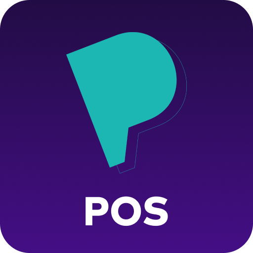

# Payment Moka

Odoo 16 için Moka sanal pos entegrasyonu. Sadece 3D secure ile çalışır.
https://developer.moka.com/home.php?page=MP-3dli-odeme dokümantasyonu referans alınarak geliştirilmiştir.

### Kurulum:

- `Faturalama/Yapılandırma/Payment Providers` menüsünden Moka ödeme yöntemini aktif ediniz.
- `Kimlik Bilgileri` kısmından Moka tarafından tanımlanan API bilgilerinizi giriniz.

### Gerekli Modüller:

- 	Bu modülü kullanabilmek için `payment` modülü kurulu olmalıdır.
### Python bağımlılıkları:
-   Bu modül herhangi bir python bağımlılığına sahip değildir.

### Notlar:

Bu modül henüz geliştirilme aşamasındadır. Odoo 16.0 temel alınarak tasarlanmıştır.

### Geliştirici:

 -  [Yiğit Budak](https://github.com/yibudak)

### Odoo Türkiye yerelleştirme projemize katkılarınızı bekliyoruz.

* Proje LGPL lisansı ile lisanslanmıştır. Katkılarınızda bu lisans koşullarını kabul etmiş sayılırsınız.
* Projemizdeki modüllerin ve içeriğin **OCA kalite standartları**nı sağlamasını amaçlıyoruz.
* [Contribute to OCA](https://odoo-community.org/page/Contribute) sayfasında genel bilgiler mevcut.
* Eklenecek modüller için genel kurallara https://github.com/OCA/maintainer-tools/blob/master/CONTRIBUTING.md adresinden erişebilirsiniz.
* Modülleri geliştirirken [OCA tarafından hazırlanan kalite kontrol programları](https://github.com/OCA/maintainer-quality-tools) ile kalite kontrol işinizi kolaylaştırabilirsiniz.
